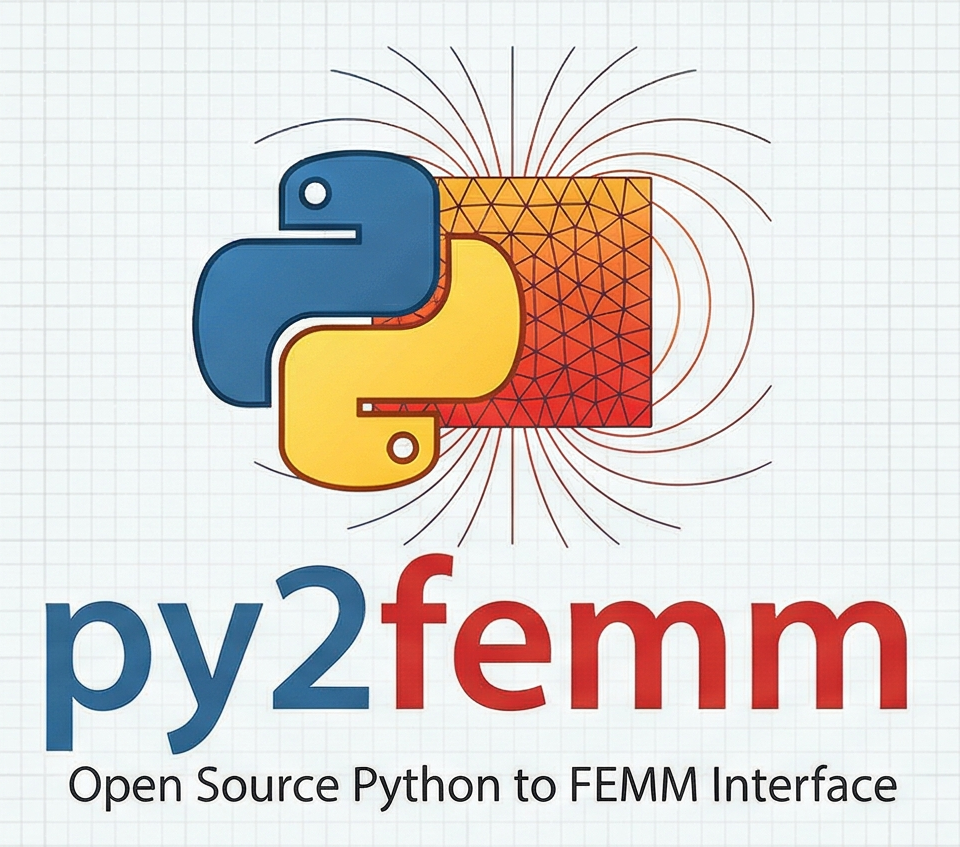

<p align="center">
  
</p>

# py2femm

**Python automation platform for FEMM finite element simulations.**

py2femm generates Lua scripts from a Python API and executes them in [FEMM 4.2](https://www.femm.info/wiki/HomePage) via a REST server. It supports **magnetics**, **electrostatics**, **heat flow**, and **current flow** problems in 2D planar and axisymmetric geometries.

---

## Why py2femm?

- **Cross-platform** -- file-based Lua generation works with Wine on Linux, in Docker, or natively on Windows. No ActiveX dependency.
- **Geometry separated from physics** -- describe a shape once, reuse it for magnetic, thermal, or electrostatic analysis.
- **REST server + parametric workflows** -- submit jobs from any client (Python, notebook, CI) and sweep dimensions, materials, or BCs programmatically.

---

## Quick links

| Where to start | Description |
|---|---|
| [Installation](getting-started/installation.md) | Install py2femm and FEMM 4.2 |
| [Quick Start](getting-started/quickstart.md) | Run your first simulation in 5 minutes |
| [FemmProblem API](guide/femm-problem.md) | Core API reference and walkthrough |
| [Heat Sink Tutorial](examples/heatsink-baseline.md) | Full worked example -- FEMM Tutorial #7 |
| [Architecture](architecture.md) | System design and component overview |

---

## Architecture at a glance

```
+--------------------+       HTTP/REST        +--------------------+
|  Python client     |  -------------------->  |  py2femm_server    |
|  (any platform)    |  <--------------------  |  (Windows + FEMM)  |
|                    |      JSON results      |                    |
|  FemmProblem API   |                        |  FastAPI + FEMM    |
|  FemmClient        |                        |  subprocess        |
+--------------------+                        +--------------------+
```

---

## Supported physics

| Field | Problem Types | Prefix | Key Outputs |
|-------|--------------|--------|-------------|
| Magnetics | Magnetostatic, time-harmonic | `mi_`/`mo_` | Flux density, force, torque, inductance |
| Electrostatics | Static electric fields | `ei_`/`eo_` | Voltage, energy, capacitance |
| Heat Flow | Steady-state thermal | `hi_`/`ho_` | Temperature, heat flux, thermal resistance |
| Current Flow | DC/AC conduction | `ci_`/`co_` | Current density, resistance, power loss |

---

## License

AGPL-3.0-or-later. See [About](about.md) for details.
